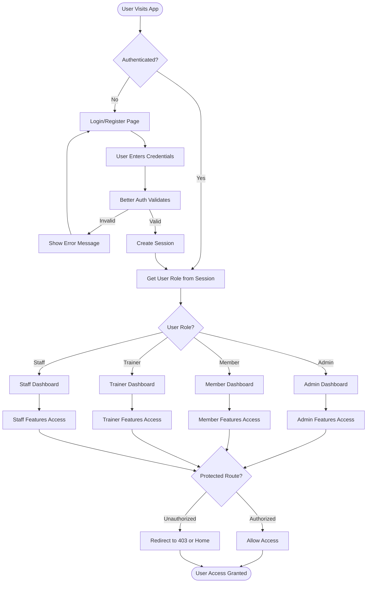
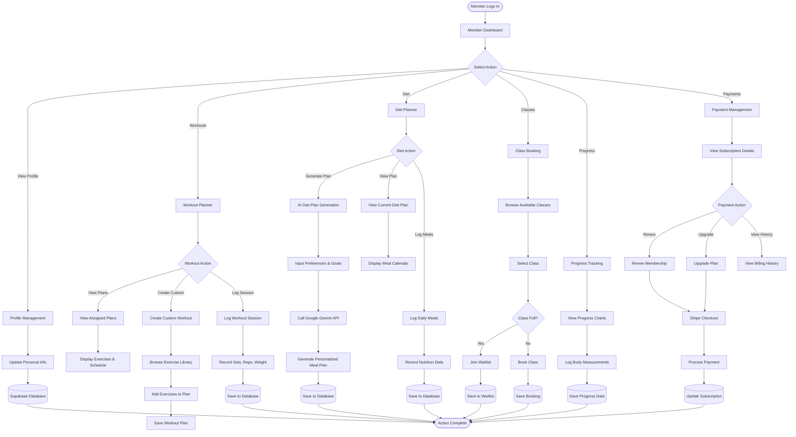
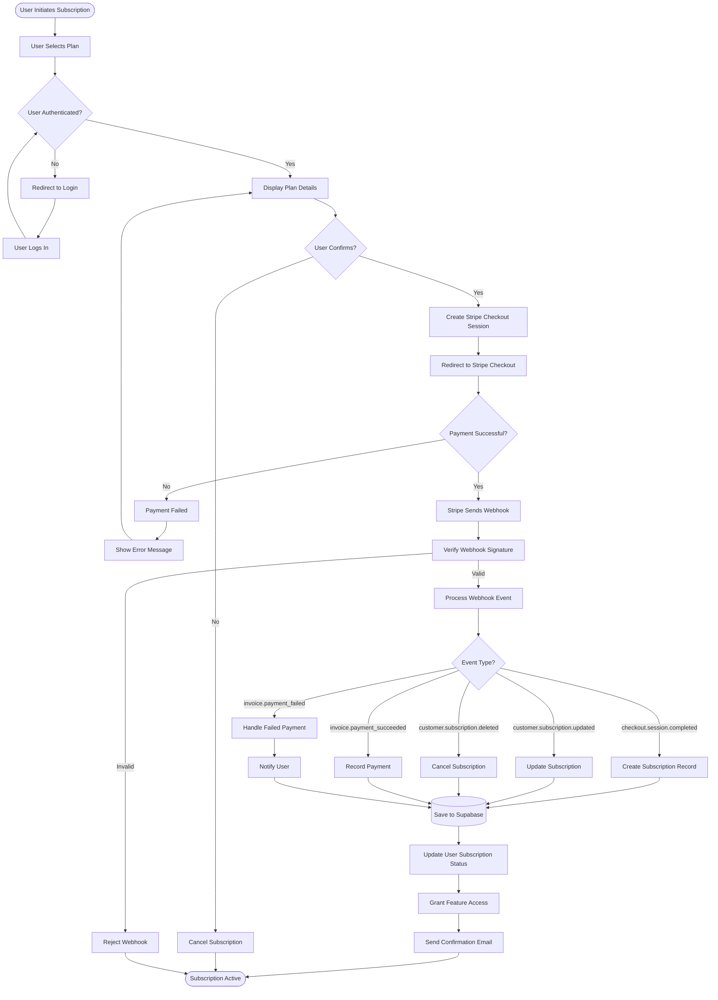
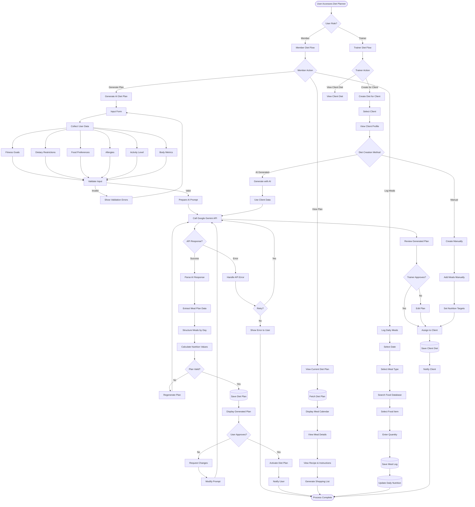
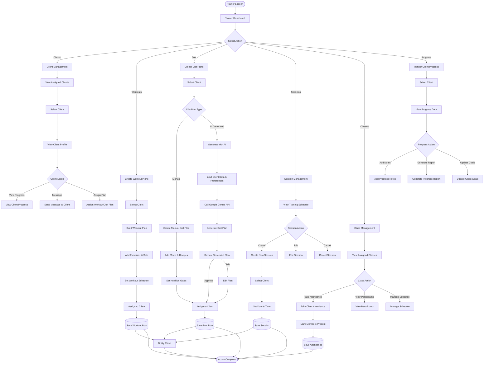
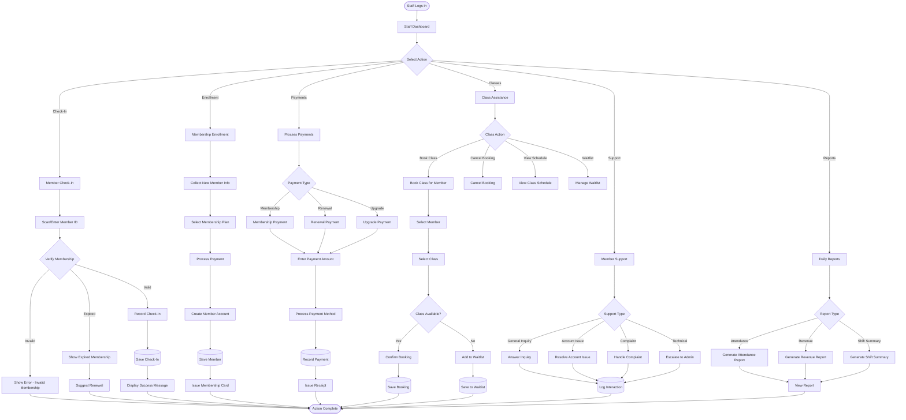
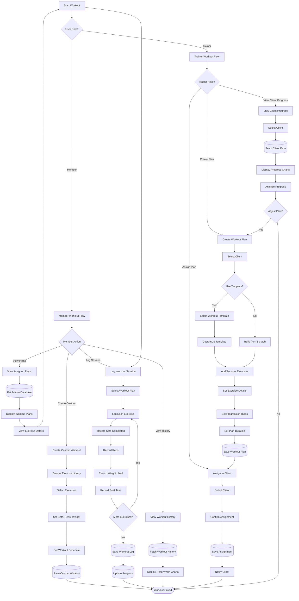
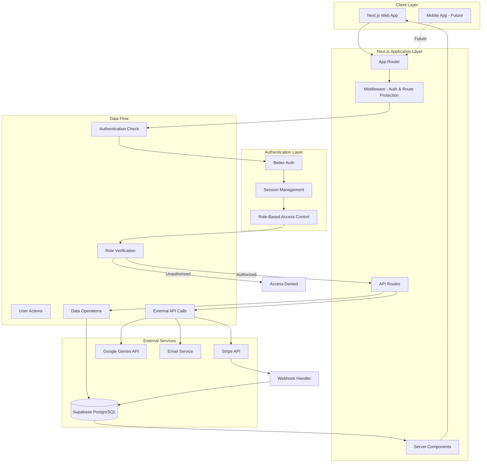

# Production-Ready Gym Dashboard with Next.js

## Architecture Overview

The application will be built using Next.js 15 with App Router, featuring:

- **Authentication**: Better Auth with role-based access control (Admin, Member, Trainer, Staff)
- **Database**: Supabase (PostgreSQL) for data persistence
- **Payments**: Stripe for subscription management
- **AI Integration**: Google Gemini API for diet planning
- **UI**: Tailwind CSS with shadcn/ui components

## Role-Based Feature Summary

### Admin (Full System Access)

- Complete user, membership, and staff management
- Financial management and reporting
- System configuration and analytics
- Class and facility management
- Comprehensive reporting dashboard

### Member (End User)

- Personal profile and membership management
- Workout planner and tracking
- AI-powered diet planner
- Class booking and personal training
- Progress tracking and achievements
- Payment and billing management

### Trainer (Client Management)

- Client management and profiles
- Workout and diet plan creation
- Session scheduling and management
- Progress monitoring and reporting
- Client communication
- Class management

### Staff (Front Desk Operations)

- Member check-in/check-out
- Membership enrollment assistance
- Payment processing
- Class scheduling support
- Member support and inquiries
- Daily operations management

## System Flowcharts

### 1. Authentication & Role-Based Access Flow




### 2. Member User Journey Flow




### 3. Subscription Management Flow




### 4. AI Diet Planner Flow




### 5. Trainer User Journey Flow




### 6. Admin User Journey Flow

```mermaid
flowchart TD
    AdminLogin([Admin Logs In]) --> AdminDashboard[Admin Dashboard]
    
    AdminDashboard --> AdminOptions{Select Management Area}
    
    AdminOptions -->|Users| UserManagement[User Management]
    AdminOptions -->|Memberships| MembershipManagement[Membership Management]
    AdminOptions -->|Financial| FinancialManagement[Financial Management]
    AdminOptions -->|Staff| StaffManagement[Staff Management]
    AdminOptions -->|Classes| ClassManagement[Class Management]
    AdminOptions -->|Facility| FacilityManagement[Facility Management]
    AdminOptions -->|Reports| ReportsAnalytics[Reports & Analytics]
    AdminOptions -->|Settings| SystemSettings[System Settings]
    
    UserManagement --> UserActions{User Action}
    UserActions -->|View All| ViewAllUsers[View All Users]
    UserActions -->|Create| CreateUser[Create New User]
    UserActions -->|Edit| EditUser[Edit User]
    UserActions -->|Delete| DeleteUser[Delete User]
    UserActions -->|Assign Role| AssignRole[Assign User Role]
    
    ViewAllUsers --> FilterUsers[Filter by Role/Status]
    CreateUser --> EnterUserDetails[Enter User Details]
    EnterUserDetails --> SaveUser[(Save to Database)]
    EditUser --> UpdateUserDetails[Update User Details]
    UpdateUserDetails --> SaveUser
    AssignRole --> UpdateRole[(Update User Role)]
    
    MembershipManagement --> MembershipActions{Membership Action}
    MembershipActions -->|View All| ViewMemberships[View All Memberships]
    MembershipActions -->|Create Plan| CreatePlan[Create Subscription Plan]
    MembershipActions -->|Process Renewal| ProcessRenewal[Process Renewal]
    MembershipActions -->|Handle Cancellation| HandleCancellation[Handle Cancellation]
    
    ViewMemberships --> FilterMemberships[Filter by Status]
    CreatePlan --> SetPlanDetails[Set Plan Details & Pricing]
    SetPlanDetails --> CreateStripeProduct[Create Stripe Product]
    CreateStripeProduct --> SavePlan[(Save Plan)]
    ProcessRenewal --> UpdateSubscription[(Update Subscription)]
    HandleCancellation --> CancelSubscription[Cancel Subscription]
    CancelSubscription --> UpdateSubscription
    
    FinancialManagement --> FinancialActions{Financial Action}
    FinancialActions -->|View Revenue| ViewRevenue[View Revenue Dashboard]
    FinancialActions -->|Process Payment| ProcessPayment[Process Payment]
    FinancialActions -->|Generate Invoice| GenerateInvoice[Generate Invoice]
    FinancialActions -->|View Reports| ViewFinancialReports[View Financial Reports]
    
    ViewRevenue --> DisplayCharts[Display Revenue Charts]
    ProcessPayment --> EnterPaymentDetails[Enter Payment Details]
    EnterPaymentDetails --> RecordPayment[(Record Payment)]
    GenerateInvoice --> CreateInvoice[Create Invoice Document]
    CreateInvoice --> SaveInvoice[(Save Invoice)]
    
    StaffManagement --> StaffActions{Staff Action}
    StaffActions -->|View Staff| ViewStaff[View All Staff]
    StaffActions -->|Create Account| CreateStaffAccount[Create Staff Account]
    StaffActions -->|Assign Schedule| AssignSchedule[Assign Staff Schedule]
    StaffActions -->|View Performance| ViewPerformance[View Performance Metrics]
    
    ClassManagement --> ClassAdminActions{Class Action}
    ClassAdminActions -->|Create Class| CreateClass[Create New Class]
    ClassAdminActions -->|Assign Trainer| AssignTrainer[Assign Trainer]
    ClassAdminActions -->|Set Capacity| SetCapacity[Set Class Capacity]
    ClassAdminActions -->|View Attendance| ViewClassAttendance[View Class Attendance]
    
    CreateClass --> SetClassDetails[Set Class Details]
    SetClassDetails --> SaveClass[(Save Class)]
    
    FacilityManagement --> FacilityActions{Facility Action}
    FacilityActions -->|Track Equipment| TrackEquipment[Track Equipment Inventory]
    FacilityActions -->|Schedule Maintenance| ScheduleMaintenance[Schedule Maintenance]
    FacilityActions -->|Manage Bookings| ManageBookings[Manage Facility Bookings]
    
    ReportsAnalytics --> ReportOptions{Report Type}
    ReportOptions -->|Membership Stats| MembershipStats[Membership Statistics]
    ReportOptions -->|Revenue Analytics| RevenueAnalytics[Revenue Analytics]
    ReportOptions -->|Attendance Reports| AttendanceReports[Attendance Reports]
    ReportOptions -->|Custom Report| CustomReport[Generate Custom Report]
    
    MembershipStats --> GenerateReport[Generate Report]
    RevenueAnalytics --> GenerateReport
    AttendanceReports --> GenerateReport
    CustomReport --> SelectMetrics[Select Metrics]
    SelectMetrics --> GenerateReport
    GenerateReport --> ExportReport[Export Report PDF/CSV]
    
    SystemSettings --> SettingsOptions{Setting Type}
    SettingsOptions -->|Subscription Plans| ConfigurePlans[Configure Plans]
    SettingsOptions -->|Integrations| ManageIntegrations[Manage Integrations]
    SettingsOptions -->|Notifications| ConfigureNotifications[Configure Notifications]
    SettingsOptions -->|Permissions| ManagePermissions[Manage Permissions]
    
    SaveUser --> End([Action Complete])
    SavePlan --> End
    UpdateSubscription --> End
    RecordPayment --> End
    SaveInvoice --> End
    SaveClass --> End
    ExportReport --> End
```




### 7. Staff User Journey Flow




### 8. Workout Planner Flow




### 9. System Architecture Overview




## Project Structure

```javascript
gym/
├── app/
│   ├── (auth)/
│   │   ├── login/
│   │   ├── register/
│   │   └── layout.tsx
│   ├── (dashboard)/
│   │   ├── admin/
│   │   ├── member/
│   │   ├── trainer/
│   │   ├── staff/
│   │   └── layout.tsx
│   ├── api/
│   │   ├── auth/
│   │   ├── workouts/
│   │   ├── diet/
│   │   └── stripe/
│   ├── layout.tsx
│   └── page.tsx
├── components/
│   ├── auth/
│   ├── dashboard/
│   ├── workout/
│   ├── diet/
│   └── ui/
├── lib/
│   ├── auth.ts
│   ├── supabase.ts
│   ├── stripe.ts
│   └── gemini.ts
├── types/
│   └── index.ts
└── middleware.ts
```


## Implementation Plan

### Phase 1: Project Setup & Configuration

1. **Initialize Next.js Project**

- Set up Next.js 15 with TypeScript
- Configure Tailwind CSS
- Install shadcn/ui components
- Set up ESLint and Prettier

2. **Environment Configuration**

- Create `.env.local` with:
    - Supabase URL and keys
    - Better Auth secret and configuration
    - Stripe API keys
    - Google Gemini API key
    - Next.js environment variables

3. **Database Schema (Supabase)**

- Users table (extends Better Auth user)
- Roles table (admin, member, trainer, staff)
- User profiles table (extended user information)
- Subscriptions table (Stripe integration)
- Subscription plans table
- Payments table
- Invoices table
- Workouts table (exercise library)
- Workout plans table
- Workout sessions table (logged workouts)
- Workout templates table
- Diet plans table
- Meal plans table
- Nutrition logs table
- Progress tracking table (measurements, weight, photos)
- Goals table
- Classes table
- Class bookings table
- Class schedules table
- Personal training sessions table
- Equipment table
- Facility bookings table
- Lockers table
- Check-ins table
- Messages/communications table
- Notifications table
- Announcements table
- Activity logs table
- Reports table

### Phase 2: Authentication & Authorization

4. **Better Auth Setup**

- Configure Better Auth with Supabase adapter
- Set up email/password authentication
- Implement role-based access control
- Create middleware for route protection
- Add role-based redirects after login

5. **Protected Routes & Middleware**

- Create middleware.ts for route protection
- Implement role-based route guards
- Set up redirect logic based on user roles
- Add session management

### Phase 3: Database & API Layer

6. **Supabase Integration**

- Set up Supabase client
- Create database schema migrations
- Implement Row Level Security (RLS) policies
- Create API routes for data operations

7. **API Routes**

- `/api/auth/*` - Better Auth endpoints
- `/api/workouts/*` - Workout CRUD operations
- `/api/diet/*` - Diet plan generation and management
- `/api/stripe/*` - Subscription webhooks and management

### Phase 4: Subscription Management

8. **Stripe Integration**

- Set up Stripe account and products
- Create subscription plans (monthly, yearly)
- Implement checkout flow
- Set up webhook handlers for subscription events
- Add subscription status checks
- Implement feature gating based on subscription

### Phase 5: Workout Planner

9. **Workout Planner Features**

- Create workout plan builder
- Exercise database/library
- Custom workout creation
- Workout templates
- Progress tracking
- Calendar view for scheduled workouts
- Exercise logging and history

### Phase 6: AI Diet Planner

10. **Google Gemini Integration**

    - Set up Gemini API client
    - Create diet plan generation endpoint
    - Implement prompt engineering for personalized plans
    - Add dietary restrictions and preferences handling
    - Create meal plan display components
    - Add nutrition tracking

11. **Diet Planner UI**

    - Diet plan generation form
    - Meal plan calendar view
    - Nutrition breakdown display
    - Shopping list generation
    - Recipe details and instructions

### Phase 7: Dashboard & UI

12. **Role-Based Dashboards & Features**

#### Admin Role Features

**User Management**

- View all users (members, trainers, staff)
- Create, edit, and delete user accounts
- Assign and modify user roles
- Activate/deactivate accounts
- View user activity logs
- Search and filter users
- Bulk user operations
- Export user data

**Membership Management**

- View all active/inactive memberships
- Create and manage subscription plans
- Process membership renewals
- Handle membership cancellations
- View membership history
- Track membership expiration dates
- Send renewal reminders
- Manage membership upgrades/downgrades

**Financial Management**

- View revenue dashboard (daily, weekly, monthly, yearly)
- Process payments and refunds
- Generate invoices
- View payment history
- Track outstanding payments
- Financial reports and analytics
- Export financial data
- Integration with accounting systems

**Staff Management**

- Manage trainer accounts
- Manage front desk staff accounts
- Assign staff schedules
- View staff performance metrics
- Staff attendance tracking
- Payroll integration (optional)

**Class & Schedule Management**

- Create and manage fitness classes
- Assign trainers to classes
- Set class capacity limits
- Manage class schedules
- View class attendance
- Cancel or reschedule classes
- Waitlist management

**Facility Management**

- Equipment inventory tracking
- Equipment maintenance scheduling
- Facility booking management
- View facility usage statistics
- Manage locker assignments

**Reporting & Analytics**

- Membership statistics dashboard
- Revenue analytics and trends
- Attendance reports
- Class popularity metrics
- Member retention analysis
- Trainer performance reports
- Equipment usage reports
- Custom report builder
- Export reports (PDF, CSV, Excel)

**System Configuration**

- Configure subscription plans and pricing
- Set system-wide settings
- Manage integrations (Stripe, email, etc.)
- Configure notification templates
- Set up automated emails
- Manage system permissions
- View system logs
- Backup and restore data

**Communication**

- Send announcements to all users
- Send targeted messages to specific groups
- View communication history
- Email template management

#### Member Role Features

**Profile Management**

- View and edit personal information
- Update profile picture
- Manage contact details
- View membership details and status
- View subscription plan details
- Download membership card

**Workout Management**

- View assigned workout plans
- Create custom workout plans
- Access exercise library
- Log workout sessions
- Track workout history
- View workout calendar
- Set workout reminders
- Mark workouts as complete
- View workout statistics

**Diet & Nutrition**

- Generate AI-powered diet plans
- View assigned diet plans
- Access meal plan calendar
- View nutrition breakdown (calories, macros, micros)
- Generate shopping lists
- View recipe details
- Track daily food intake
- Log meals and snacks
- View nutrition progress

**Progress Tracking**

- View progress dashboard
- Track body measurements
- Log weight and body fat percentage
- View progress photos
- Track fitness goals
- View progress charts and graphs
- Set and update fitness goals
- View achievement badges

**Class Booking**

- Browse available fitness classes
- Book classes
- View booked classes
- Cancel class bookings
- Join class waitlists
- View class schedule
- Receive class reminders
- View class history

**Personal Training**

- Request personal training sessions
- View trainer profiles
- Book training sessions
- View training session history
- Message assigned trainer
- View training session notes

**Payment Management**

- View subscription details
- Update payment methods
- View billing history
- Download invoices
- Renew membership
- Upgrade/downgrade subscription
- View payment receipts
- Set up auto-renewal

**Communication**

- Receive notifications
- Message trainers
- View announcements
- Contact support
- View message history

**Achievements & Rewards**

- View earned badges
- Track milestones
- View leaderboards (optional)
- View reward points (if applicable)

#### Trainer Role Features

**Client Management**

- View assigned clients list
- View client profiles and details
- View client progress and history
- Search and filter clients
- View client subscription status
- Client activity tracking

**Workout Planning**

- Create personalized workout plans for clients
- Assign workout plans to clients
- Edit and update client workout plans
- Use workout templates
- Access exercise library
- Create custom exercises
- Schedule workouts for clients
- View client workout completion

**Diet Planning**

- Create personalized diet plans for clients
- Assign diet plans to clients
- Edit and update client diet plans
- Use AI to generate diet plans
- View client nutrition tracking
- Provide dietary recommendations

**Session Management**

- Schedule personal training sessions
- View training session calendar
- Manage session availability
- Cancel or reschedule sessions
- View session history
- Log session notes
- Track session attendance

**Progress Monitoring**

- View client progress dashboard
- Track client body measurements
- View client progress photos
- Log client progress notes
- Generate progress reports
- Compare client progress over time
- Set and track client goals

**Communication**

- Message clients
- Send workout reminders
- Send motivational messages
- Receive client messages
- View communication history
- Send progress updates

**Class Management**

- View assigned classes
- Manage class schedules
- View class attendance
- Take class attendance
- View class participant list
- Manage class capacity

**Analytics**

- View client engagement metrics
- Track client retention
- View session statistics
- View class attendance rates
- View personal performance metrics

**Resources**

- Access training resources
- Share resources with clients
- Create training content
- View exercise database

#### Staff Role Features

**Member Check-In/Check-Out**

- Check members in/out at front desk
- View member check-in history
- Verify membership status
- Handle guest passes
- View real-time gym occupancy

**Membership Enrollment**

- Assist with new member registration
- Process membership sign-ups
- Explain membership plans
- Process membership upgrades
- Handle membership inquiries

**Payment Processing**

- Process in-person payments
- Issue payment receipts
- Handle cash and card payments
- Process membership renewals
- View payment history
- Handle refund requests (with approval)

**Class Scheduling Assistance**

- Help members book classes
- View class schedules
- Manage class waitlists
- Assist with class cancellations
- Answer class-related inquiries

**Member Support**

- Answer member questions
- Handle member complaints
- Provide general information
- Assist with account issues
- Direct members to appropriate resources

**Facility Management**

- Monitor facility cleanliness
- Report equipment issues
- Manage locker assignments
- Track facility usage
- Handle facility bookings

**Daily Operations**

- View daily schedule
- View member attendance for the day
- View class schedules
- Monitor gym capacity
- Handle day-to-day inquiries

**Reports**

- View daily attendance reports
- View daily revenue reports
- Generate shift reports
- View member activity logs

13. **UI Components**

    - Responsive navigation with role-based menu
    - Dashboard cards and widgets
    - Data tables for admin views
    - Forms for workout/diet creation
    - Progress charts and visualizations

### Phase 8: Production Readiness

14. **Error Handling & Validation**

    - Form validation with Zod
    - Error boundaries
    - Toast notifications
    - Loading states

15. **Security & Performance**

    - Input sanitization
    - Rate limiting on API routes
    - Image optimization
    - Code splitting
    - SEO optimization

16. **Testing & Deployment**